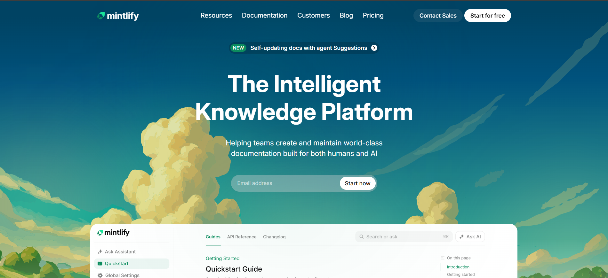
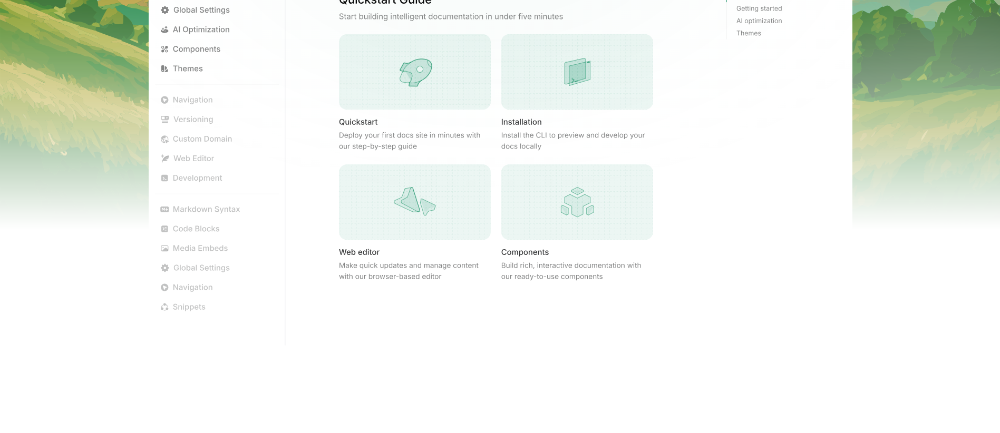
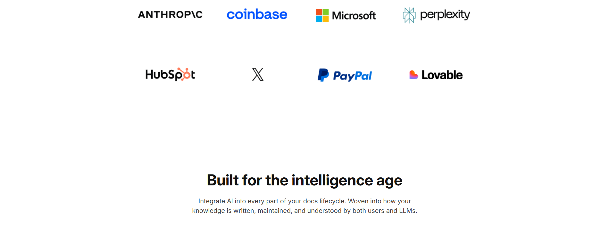
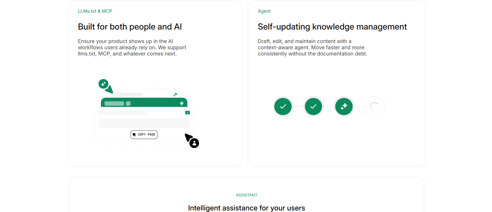
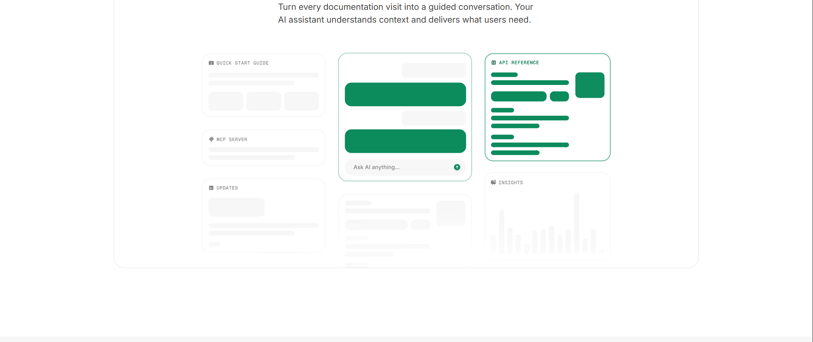
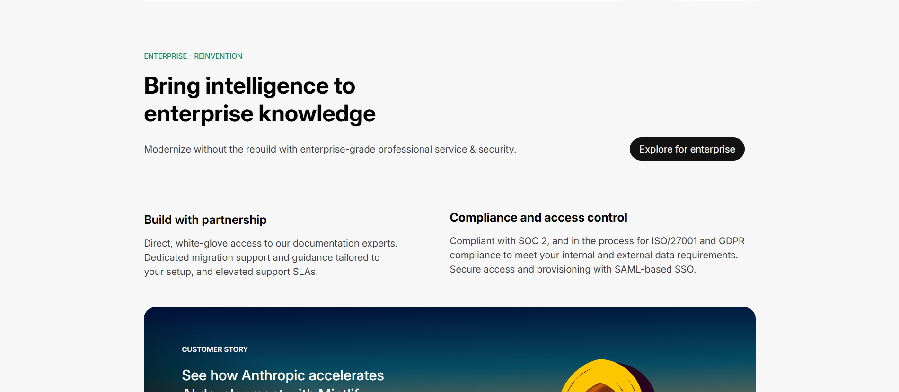

# Mintlify - The Intelligent Knowledge Platform (Clone)

A high-fidelity, responsive landing page clone of **Mintlify**. This project focuses on modern UI/UX design, utilizing semantic HTML and advanced CSS techniques to recreate the "Intelligence Age" documentation experience.

🚀 Live Demo

[View the Live Website](https://mintlify-clone-eight.vercel.app/)

📸 Final Output

Below are the screenshots of the implemented design:

#### Hero & Navbar Section







🛠️ Implementation Details

This project was built for the **Web Dev Cohort 2026** to demonstrate mastery over layout systems and modern CSS properties.

🏛️ Document Structure & Semantics

* **Semantic Layout:** Used `<nav>`, `<section>`, and `<footer>` to provide a clear document outline for accessibility.
* **SVG Integration:** Direct embedding of SVG icons for the Mintlify logo and social media links to ensure crisp visuals at any scale.
* **Sticky Navigation:** Implemented a `sticky` navbar with `backdrop-filter: blur(5px)` for a modern, glassmorphism effect.

🎨 CSS Mastery

* **Custom Variables:** Used CSS `:root` variables for consistent branding (Primary Green: `#0C8C5E`).
* **Flexbox & Grid:** * **Flexbox:** Used for the navigation bar, hero content alignment, and feature cards.
    * **Grid:** Utilized `display: grid` for the company logo section and the multi-column footer layout.
* **Inter Font:** Integrated Google Fonts "Inter" (weights 100-900) to match the official branding.
* **Hover Effects:** Smooth transitions on buttons and navigation links for an interactive user experience.

📊 Key Sections

1. **Hero Area:** Dynamic announcement bar ("NEW") and email subscription input.
2. **Social Proof:** Logo grid featuring industry leaders like Microsoft, Anthropic, and Coinbase.
3. **Enterprise Reinvention:** Detailed cards highlighting compliance (SOC 2) and partnership models.
4. **Customer Stories:** Interactive-style cards for Perplexity, X (Twitter), and Kalshi.

⚙️ Setup & Usage

Follow these steps to view the project locally:

1.  **Clone the Repository:**
    ```bash
    git clone [https://github.com/KenilPatel/mintlify-clone.git](https://github.com/KenilPatel/mintlify-clone.git)
    ```

2.  **Navigate to Directory:**
    ```bash
    cd mintlify-clone
    ```

3.  **Launch:** Open the `index.html` file in any modern web browser (Chrome, Edge, or Brave recommended).

👤 Author

**Kenil Patel** GitHub: [@KenilPatel](https://github.com/KenilPatel)  
Batch: Web Dev Cohort 2026

© 2026 Kenil Patel. All rights reserved.